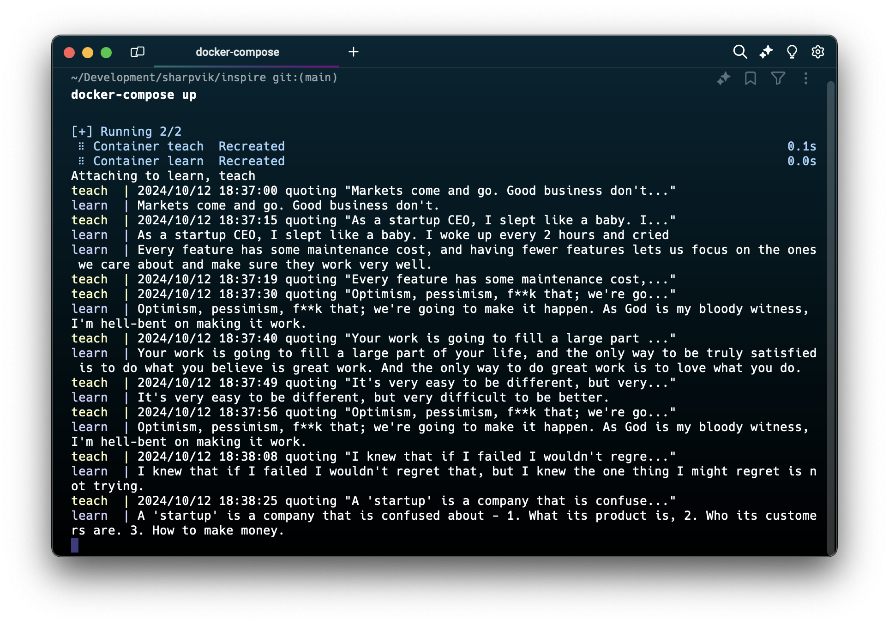

# Inspire (interview test task)

## Usage instructions

### Test

```bash
go test ./...
```

### Run in Docker (locally)

```bash
docker-compose up
```



## How it came to be

### Preface

Some time ago I wrote [PURR](https://github.com/sharpvik/purr)
(Protocol for Universal Request-Response Communication) to teach my friend how
to implement custom TCP protocols in Go. I took it as the foundation, added
proof-of-work checking to the request-response cycle and _voila_!

I used [go-pow](github.com/bwesterb/go-pow) as my PoW algorithm.

### Main

Once that was done, all that's left to do is fill up the [cmd](./cmd) folder
with the `main` files (client and server) that satisfy functional requirements.
I called the server - `teach`; and the client is called - `learn`.

For the server, I found some quotes
[here](https://github.com/gophergala/wisdom/blob/master/data/populate_db.go_example)
and copied them over as strings.

### Dockerization

Dockerfiles are stored in the [.docker](./.docker) folder. The resulting images
are built `FROM scratch` and contain just the Go binary, which makes them nice
and lightweight at around 3MB each.

```text
REPOSITORY  TAG     IMAGE ID      CREATED         SIZE
learn       latest  d2a74e15d055  17 minutes ago  3.19MB
teach       latest  0dfd6d881028  17 minutes ago  3.26MB
```

## Notes

I wouldn't call this a _production-ready_ technology. The server doesn't
implement any kind of graceful connection handling (e.g. telling the client
what's wrong in case of a transaction error).

This is simply a PoC server that uses PoW to PIMAGSE (prove I'm a good software
engineer). Yeah, it's a pun. Hope you appreciate a little bit of humour.
